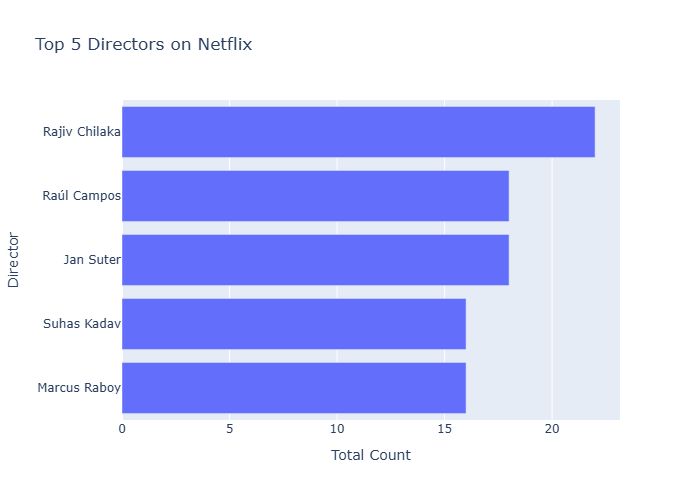
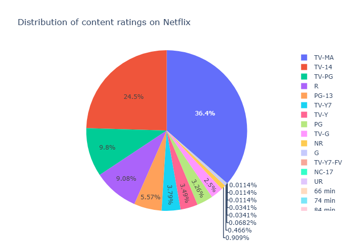
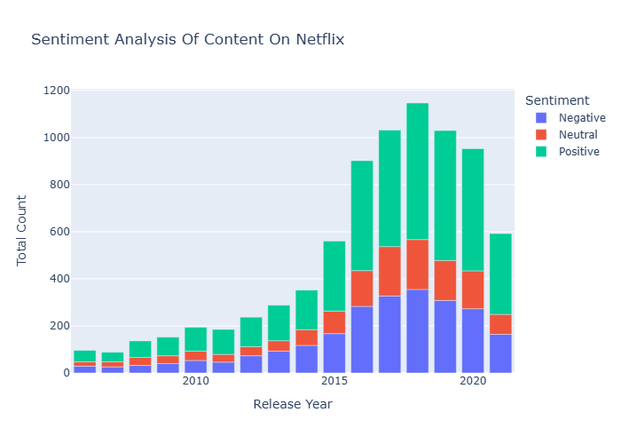
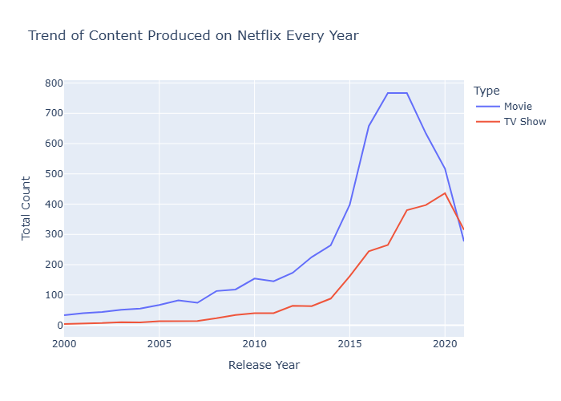
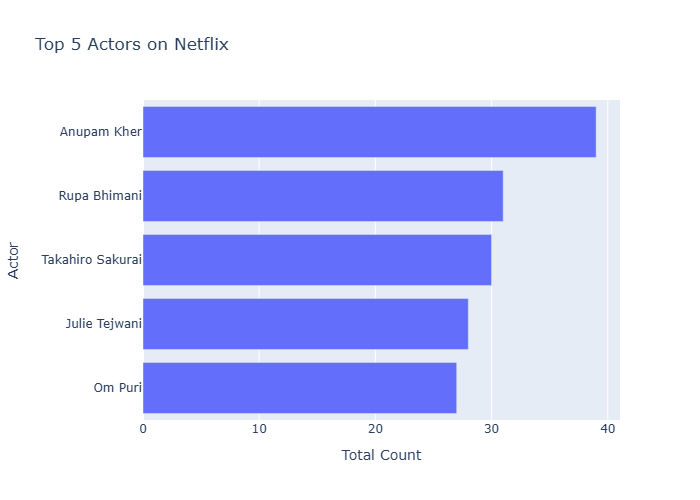

# Netflix-EDA-Analysis
Exploratory Data Analysis on Netflix Movies &amp; Shows Dataset using Pandas, NumPy, and Seaborn

This project explores trends and patterns in Netflix shows using Pandas, NumPy, and Seaborn.

## Dataset
Netflix Movies and TV Shows Dataset: [Kaggle](https://www.kaggle.com/datasets/shivamb/netflix-shows)

## Key Tools
- Python
- Pandas
- NumPy
- Matplotlib & Seaborn

## What I Did
- Cleaned 8+ columns (missing values, types)
- Analyzed release years, genres, durations
- Visualized most common categories and content trends

## Visualizations

### Top 5 Directors on Netflix

### Distribution of Content Ratings on Netflix

### Sentiment Analysis of Content by Year

### Trend of Content Produced on Netflix Every Year

### Top 5 Actors on Netflix

## Learnings
- Improved EDA and visualization techniques
- Learned to communicate insights clearly

## Author
Kwabena Mensah Sarpong • [@sarpongkm](https://github.com/sarpongkm)
